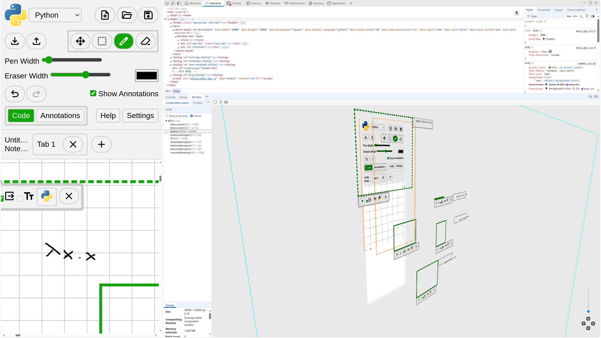

# Enscribe

## Development
### Docker
This repo has been setup to make development using docker containers as easy as possible.
- `git clone ...`

The only thing you need to do is create a .env file in the outermost directory of this repo:
.env:
```env
DJANGO_ENV='development'
SECRET_KEY='...'
PORT='...'
EMAIL_ADDRESS='...' # Email account for application (for password reset)
EMAIL_PASSWORD='...' # App password for email account
JUPYTER_URL='...' # URL of jupter server
JUPYTER_PORT='...' # Port of jupter server
JUPYTER_TOKEN='...' # Authentication token of jupter server
```
Replace the ... with some random string. Django can generate a key for you with the following CLI command:
```bash
python -c "from django.core.management.utils import get_random_secret_key; print(get_random_secret_key())"
```

If `PORT` is not specified, the default is `5000`.

From here you can build and the start the container
- `docker-compose build`
- `docker-compose up`

This will launch the application locally and is accessible at `localhost:5000`.

### Local
Alternatively you can install the requirements yourself and run using python locally. This project uses poetry for package management.
- `git clone ...`
- `pip install poetry` - one time only!
- `cd backend`
- `poetry install`
- `poetry run python app.py`

### pre-commit
If you are contributing to this project we would greatly appreciate you setup our pre-commit hook to ensure you are following our formatting standard. This can be done easily:
- `cd backend`
- `poetry install` - If not already done¬
- `poetry run pre-commit install`

Now whenever you attempt to commit, our ruff formatting checks will be ran automatically.

### Jupyter
To start up a local jupyter server:

`jupyter server --ServerApp.disable_check_xsrf=True`

Set the environment variables using the url from the command output which follows the format:

`http://JUPYTER_URL:JUPYTER_PORT/?token=JUPYTER_TOKEN`

## Frontend Implementation Notes
### Frontend Testing

We use [Jest](https://jestjs.io) for frontend (JS) unit testing. The environment variable is necessary to enable ECMAScript module support in Jest, which is [currently experimental](https://jestjs.io/docs/ecmascript-modules).

``` bash
$ cd backend
$ npm install
$ NODE_OPTIONS="$NODE_OPTIONS --experimental-vm-modules" npx jest
```

### User Interface DOM Layout
The user interface is composed of several overlapping elements, including a mixture of canvases and divs. See `layering_example.html` (accessible at route `/layering`) for an example of how we can use these layers. Below is a rough illustration of how the DOM is structured:



The background, code and annotations stay on separate layers, which makes them easy to manipulate independently, e.g. by changing the background while still displaying code over it, or toggling annotation visibility. We will also have UI elements, such as the borders around code blocks, that must render on top of the writing layers, and are positioned accordingly. For these, we use DOM elements, which come with many benefits like dynamic scaling and styling.

When multiple elements overlap at a point, a pointer event there is sent only to the element with the highest Z index, and then propagates up through its ancestors. In order for us to be able to write on the canvases underneath the UI layer, we apply `pointer-events: none` to most UI elements, allowing us to handle "writing" input just on the base UI layer element. Any UI elements that should be clickable, such as buttons, can have the CSS property `pointer-events: auto`.
